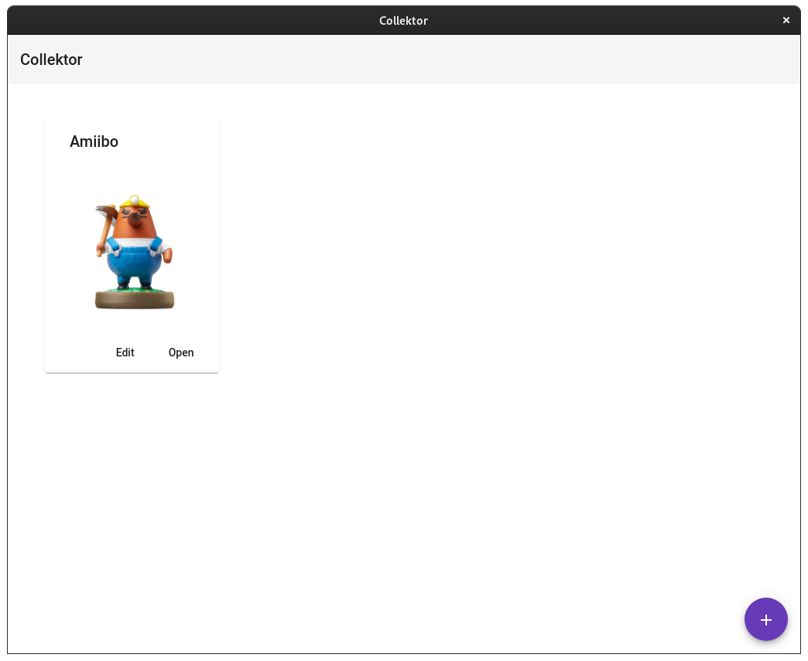

# Collektor

A simple collection manager to keep tracking all your collections.

## Screenshots

## Architecture

### Build with

- Frontend:
    - Angular
    - Angular Material
- Backend:
    - Java 15
    - Quarkus
    - ShieldDB
- Desktop Wrapper:
    - Electron
    - Embedded Custom JVM

### Structure

The backend embed the frontend, so it's possible to run the backend and the frontend without the electron wrapper. The desktop wrapper create a convinient way to start the Collektor app.
